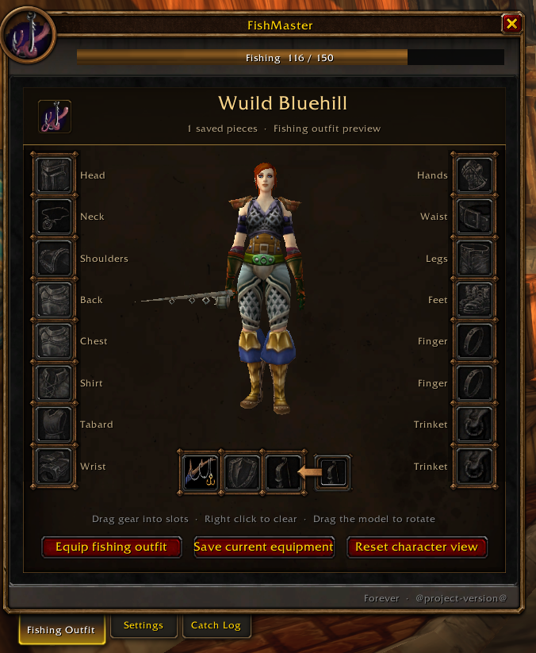
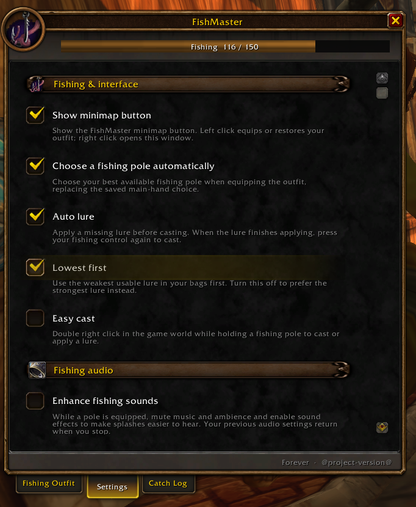

# FishMaster

Save and swap fishing outfits, apply lures, and track your catches in **WoW Forever**. Supports Forever 1.60.1 only.

## Features

- **Fishing outfits:** save gear with a character preview, equip it in one click, and restore your previous equipment.
- **Double-right-click casting:** enable Easy cast to cast or apply a lure by double-right-clicking in the world while holding a fishing pole.
- **Accessible cast/bobber key:** set a key under **Settings → Bobber interaction**. Press it to cast, then again at the splash to interact with the bobber using WoW's accessibility targeting. Face the bobber and enable Auto Loot for immediate collection. Your usual key action and interaction setting return when you put the pole away.
- **Automatic pole and lure selection:** choose a pole automatically and apply missing lures, with weakest- or strongest-lure preference. Press again after a lure finishes applying to cast.
- **Fishing audio:** make splashes easier to hear with temporary sound and volume settings that restore when you stop fishing.
- **Catch tracking:** view session and lifetime catches across zones, a floating current-zone tracker, and an optional trash filter.

## Installation

Download from [CurseForge](https://www.curseforge.com/wow/addons/fishmaster/files) and place the `FishMaster` folder in `Interface/AddOns`.

## Using FishMaster

- **`/fishmaster` or `/fmaster`** — equip your fishing outfit or restore your previous gear.
- **`/fishmaster config`** — open your outfit and settings. Drag gear into slots to save it; right-click to clear.
- **`/fishmaster loot`** — view your catch history.
- **Minimap button:** left-click to equip or restore; right-click to open settings.

## Screenshots

## Support

[Report an issue](https://github.com/Wuild/FishMaster/issues) · [Release notes](CHANGELOG.md) · [Development and publishing](docs/DEVELOPMENT.md)
